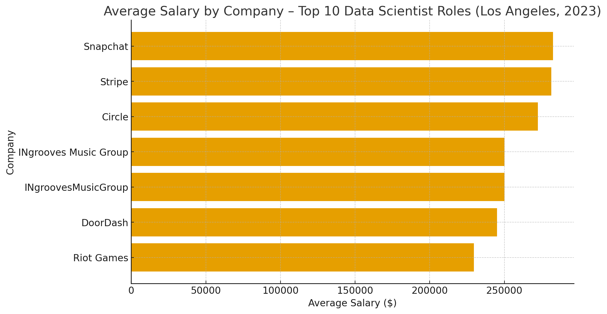
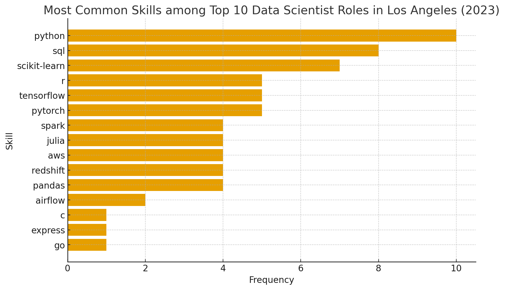

# Introduction
Diving into the data job market! Focusing on data scientist roles, this project explores top-paying jobs, in-demand skills, and where high demand meets high slary in data science.

SQL Queries? Check them out here: [project_sql folder](/project_sql/)
# Background
Data comes from Luke Barousse's [SQL For Data Analytics Course](https://www.lukebarousse.com/products/sql-for-data-analytics).

### The questions I wanted to answer through my SQL queries were:
1. What are the top-paying data scientist jobs in Los Angeles?
2. What skills are required for these top-paying jobs?
3. What skills are most in-demand for data scientists?
4. Which skills are associated with higher salaries?
5. What are the most optimal skills to learn?
# Tools I Used
For my dive into the data science job market, I used several tools:

- **SQL:** The backbone of my analysis, allowing me to query the database and discover important insights.
- **PostgreSQL:** The chosen database management system, ideal for handling this type of data.
- **VS Code:** My IDE of choice for programming and database management, as well as executing SQL queries.
- **Git and GitHub:** Essential for version control and sharing my SQL scripts and analysis.
# Analysis
Each query for this project is aimed at inspecting key aspects of the data science job market.

### 1. Top Paying Data Scientist Jobs
To identify the highest-paying roles, I filtered data analyst positions by average yearly salary and location, focusing on remote jobs. This query highlights the high paying opportunities in the field.

```sql
SELECT 
    job_id,
    job_title,
    job_location,
    job_schedule_type,
    salary_year_avg,
    job_posted_date,
    company_dim.name AS company_name
FROM
    job_postings_fact
LEFT JOIN company_dim ON job_postings_fact.company_id = company_dim.company_id
WHERE
    job_title_short = 'Data Scientist' AND
    job_location LIKE '%Los Angeles%' AND 
    salary_year_avg IS NOT NULL
ORDER BY 
    salary_year_avg DESC
LIMIT 10;
```

💰 Salary Insights

- Average salary: ≈ $254K

- Highest: $282.5K at Snapchat

- Lowest: $225K at Riot Games

- Salary range is narrow, showing that top roles are highly competitive and senior-level (mostly manager, lead, or director).

Los Angeles’ top-paying data-science roles are:

- Heavily concentrated in tech and entertainment-adjacent industries

- Managerial or lead-level, blending data leadership, ML deployment, and product impact

- Best-compensated at companies linking AI + product personalization (Snapchat, Stripe) or AI + media (INgrooves, Riot Games).



### 2. Skills for Top Paying Jobs
To understand what skills are required for the top-paying jobs, I joined the job postings with the skills data, providing insights into what employers value for high-compensation roles.

```sql
WITH top_paying_jobs AS (
    SELECT 
        job_id,
        job_title,
        salary_year_avg,
        company_dim.name AS company_name
    FROM
        job_postings_fact
    LEFT JOIN company_dim ON job_postings_fact.company_id = company_dim.company_id
    WHERE
        job_title_short = 'Data Scientist' AND
        job_location LIKE '%Los Angeles%' AND 
        salary_year_avg IS NOT NULL
    ORDER BY 
        salary_year_avg DESC
    LIMIT 10
)

SELECT 
    top_paying_jobs.*,
    skills
FROM top_paying_jobs
INNER JOIN skills_job_dim ON top_paying_jobs.job_id = skills_job_dim.job_id
INNER JOIN skills_dim ON skills_job_dim.skill_id = skills_dim.skill_id
```

Here’s an analysis of the skill distribution for the top 10 data scientist roles in Los Angeles:

- Python dominates all listings, appearing in nearly every role (10/10). It’s the primary language for modeling, data cleaning, and production-level pipelines.

- SQL is the second most common (8 mentions), emphasizing the need for strong database querying and data wrangling skills.

- Scikit-learn appears frequently (7 mentions), showing that classical machine learning and model deployment remain key requirements.

- R and TensorFlow tie (5 mentions each), reflecting dual needs — statistical modeling (R) and deep learning (TensorFlow).

- Overall, hiring trends suggest hybrid proficiency — Python + SQL + ML libraries — as the foundation for data scientists in LA, with bonus points for deep learning and statistical expertise.



### 3. In-Demand Skills for Data Scientists
This query helped identify the skills most frequently requested in job postings, directing focus to areas with high demand.

```sql
SELECT skills,
    COUNT(skills_job_dim.job_id) AS demand_count
FROM job_postings_fact
INNER JOIN skills_job_dim ON job_postings_fact.job_id = skills_job_dim.job_id
INNER JOIN skills_dim ON skills_job_dim.skill_id = skills_dim.skill_id
WHERE 
    job_title_short = 'Data Scientist'
GROUP BY
    skills
ORDER BY
    demand_count DESC
LIMIT 5;
```

| **Skill**  | **Demand Count** |
|-------------|------------------|
| Python      | 114,016          |
| SQL         | 79,174           |
| R           | 59,754           |
| SAS         | 29,642           |
| Tableau     | 29,513           |


- Python is by far the most dominant skill — appearing in more than 114K job listings, confirming its status as the universal language of data science.

- SQL follows closely, showing that data querying and pipeline work remain essential even in advanced AI roles.

- R continues to have strong relevance, especially for statistical modeling and research analytics.

- SAS and Tableau highlight ongoing demand for legacy enterprise tools and data visualization expertise in business-oriented roles.

Overall, the trend shows that technical versatility (Python + SQL + visualization) is the foundation of employability, while domain-specific tools (R, SAS, Tableau) offer specialization advantages.

### 4. Skills Based on Salary
Exploring the average salaries associated with different skills revealed which skills are the highest paying.

```sql
SELECT 
    skills,
    ROUND(AVG(salary_year_avg), 0) AS avg_salary
FROM job_postings_fact
INNER JOIN skills_job_dim ON job_postings_fact.job_id = skills_job_dim.job_id
INNER JOIN skills_dim ON skills_job_dim.skill_id = skills_dim.skill_id
WHERE 
    job_title_short = 'Data Scientist' AND
    salary_year_avg IS NOT NULL 
GROUP BY
    skills
ORDER BY
    avg_salary DESC
LIMIT 25;
```

| **Skill** | **Avg Salary ($)** |
|------------|--------------------|
| Asana      | 215,477            |
| Airtable   | 201,143            |
| Red Hat    | 189,500            |
| Watson     | 187,417            |
| Elixir     | 170,824            |


- Asana ($215K) – Indicates strong value placed on data science managers and team leads who excel in agile project management and workflow orchestration within data teams.

- Airtable ($201K) – Reflects the rise of hybrid low-code platforms that allow for rapid data prototyping, automation, and collaborative analytics — bridging technical and business roles.

- Red Hat ($189K) – Signals high demand for engineers skilled in model deployment and infrastructure within enterprise Linux and open-source environments.

- Watson ($187K) – Highlights the premium on enterprise-grade AI and NLP expertise, particularly for large-scale corporate AI integrations in sectors like healthcare and finance.

- Elixir ($171K) – Suggests that proficiency in scalable, concurrent backend development for AI and data-heavy systems is highly rewarded.

Overall Insight:
High-paying skills in 2025 emphasize AI operations, infrastructure, and integration — not just data modeling. The top earners are those who can connect data workflows, automation tools, and scalable systems across the organization. 

### 5. Most Optimal Skills to Learn
Combining insights from demand and salary data, this query aimed to pinpoint skills that are both in high demand and have high salaries, offering a strategic focus for skill development.

```sql
WITH skills_demand AS (
    SELECT
        skills_dim.skill_id, 
        skills_dim.skills,
        COUNT(skills_job_dim.job_id) AS demand_count
    FROM job_postings_fact
    INNER JOIN skills_job_dim ON job_postings_fact.job_id = skills_job_dim.job_id
    INNER JOIN skills_dim ON skills_job_dim.skill_id = skills_dim.skill_id
    WHERE 
        job_title_short = 'Data Scientist'
        AND salary_year_avg IS NOT NULL 
        AND job_location LIKE '%Los Angeles%'
    GROUP BY
        skills_dim.skill_id
), average_salary AS (
    SELECT
        skills_job_dim.skill_id, 
        ROUND(AVG(salary_year_avg), 0) AS avg_salary
    FROM job_postings_fact
    INNER JOIN skills_job_dim ON job_postings_fact.job_id = skills_job_dim.job_id
    INNER JOIN skills_dim ON skills_job_dim.skill_id = skills_dim.skill_id
    WHERE 
        job_title_short = 'Data Scientist' AND
        salary_year_avg IS NOT NULL 
        AND job_location LIKE '%Los Angeles%'
    GROUP BY
        skills_job_dim.skill_id
)


SELECT 
    skills_demand.skill_id,
    skills_demand.skills,
    demand_count,
    avg_salary
FROM
    skills_demand
INNER JOIN average_salary ON skills_demand.skill_id = average_salary.skill_id
WHERE
    demand_count > 10
ORDER BY
    avg_salary DESC,
    demand_count DESC
LIMIT 25;
```

| **Skill**       | **Demand Count** | **Avg Salary ($)** |
|------------------|------------------|--------------------|
| PyTorch          | 11               | 209,045            |
| Scikit-learn     | 11               | 207,773            |
| TensorFlow       | 14               | 195,149            |
| AWS              | 14               | 185,041            |
| Spark            | 15               | 175,507            |


- PyTorch ($209K) – Represents the gold standard for deep learning development, particularly in research-driven AI roles. Its combination of high pay and demand suggests employers value practical deployment experience with neural architectures.

- Scikit-learn ($207K) – Shows that classical machine learning remains essential. Companies reward those who can efficiently use proven algorithms for production-ready solutions — not just experimental models.

- TensorFlow ($195K) – Highlights ongoing corporate reliance on Google’s ML ecosystem, particularly in large-scale model training and production pipelines.

- AWS ($185K) – Demonstrates that cloud computing proficiency is central to scaling AI workloads. The premium reflects the need for data scientists who can integrate ML systems with cloud-based infrastructure.

- Spark ($175K) – Underscores demand for big data processing and distributed computing. Professionals who can handle data at scale — bridging data engineering and ML — remain highly compensated.

Overall Insight:
Top-tier skills blend AI frameworks (PyTorch, TensorFlow) with infrastructure expertise (AWS, Spark). The market increasingly rewards data scientists who can both build and operationalize models, emphasizing versatility over specialization. 

# What I Learned

Throughout this adventure, I leveled up my SQL and data analysis skills with some serious upgrades:

🧩 **Complex Query Crafting:** Mastered multi-table joins, refined `WITH` clauses (CTEs), and learned how to blend datasets to uncover deep relationships across job postings, salaries, and skills.  

📊 **Analytical Aggregation:** Got fluent with `GROUP BY`, `COUNT()`, and `AVG()` — transforming raw job data into meaningful patterns about skill demand and salary trends.  

⚙️ **Real-World Application:** Moved beyond textbook queries to design analytical SQL that mirrors real business questions — identifying where high demand meets high pay in data science.  

💡 **Data Storytelling:** Turned SQL outputs into insights and visuals that explain not just *what* the numbers say, but *why* they matter in the modern data job market.  

---

# Conclusions

### 🔍 Insights
From this analysis, several key insights emerged about the data science job landscape in 2025:

- **Top-Paying Data Scientist Jobs:** The highest-paying roles in Los Angeles average around **$254K**, concentrated in tech and entertainment industries like **Snapchat, Stripe, and Riot Games**.  
- **Skills for Top-Paying Jobs:** Mastery of **Python, SQL, and Scikit-learn** forms the backbone of high-paying data science positions, with deep learning and leadership skills boosting earnings further.  
- **Most In-Demand Skills:** **Python** dominates in demand, but **SQL** remains the indispensable skill that every data scientist needs to handle and query data efficiently.  
- **Skills with Higher Salaries:** Tools like **Asana, Airtable, and Red Hat** command higher average salaries, suggesting companies reward those who can integrate AI with workflow and infrastructure.  
- **Optimal Skills for Market Value:** **PyTorch, TensorFlow, AWS, and Spark** balance both high salary and demand — ideal targets for data scientists aiming to stay competitive in a rapidly evolving field.  

---

# Closing Thoughts

This project didn’t just sharpen my SQL skills — it connected technical analysis with real-world career insight.  
By exploring thousands of job postings, I gained a clearer view of what truly drives success in data science:  

- **Strong fundamentals (Python, SQL, ML frameworks)**  
- **Infrastructure know-how (AWS, Spark)**  
- **Strategic problem-solving**  

Ultimately, this exploration proved that data science isn’t just about building models — it’s about **bridging insights, automation, and business value**.  
The journey reinforced one powerful takeaway: **the best data scientists never stop learning, adapting, and connecting the dots between data and decision-making.**
